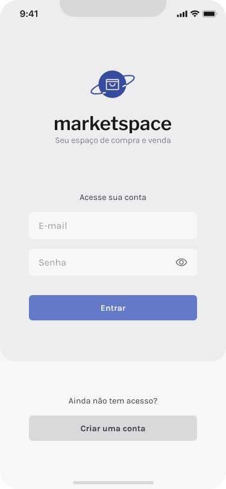
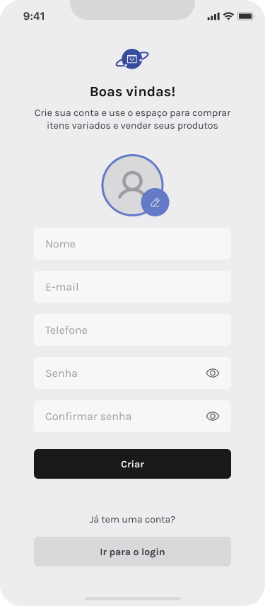
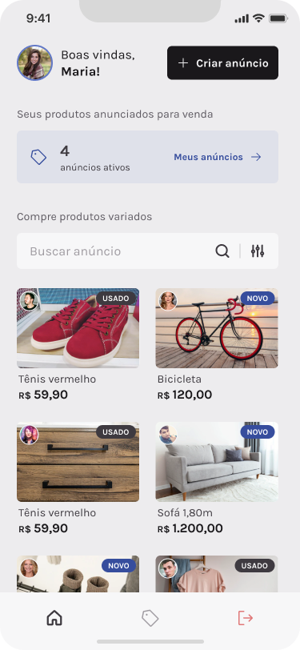
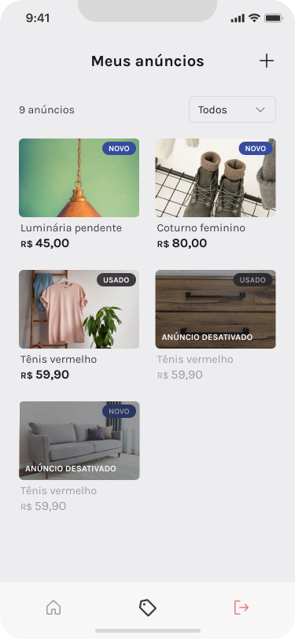
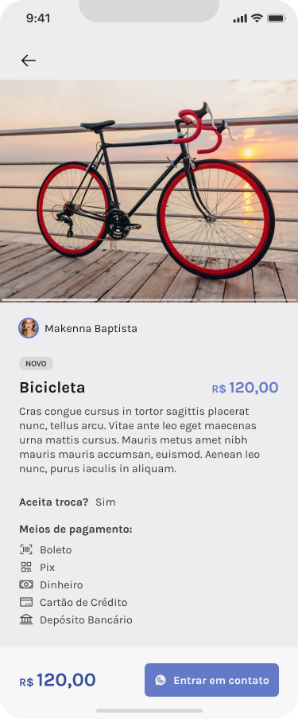
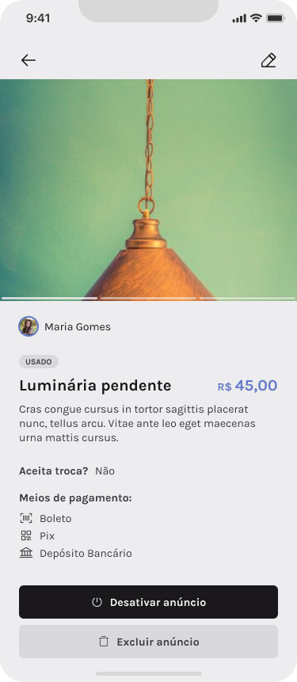
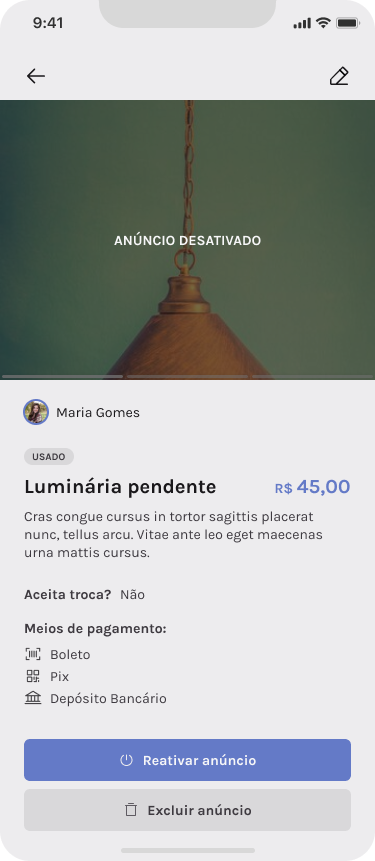
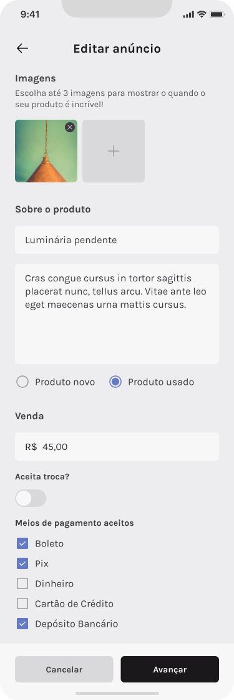
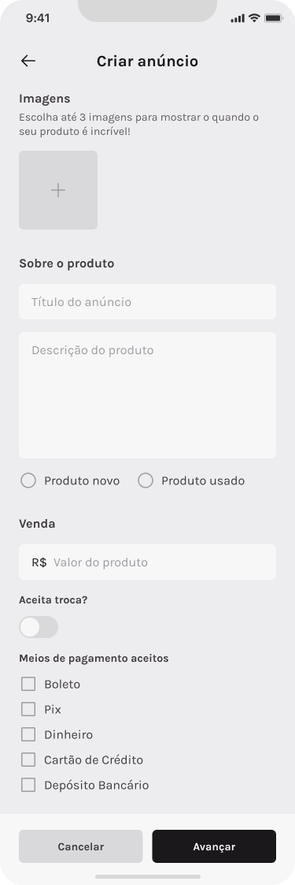

# MARKETSPACE

<p align="center">
  
</p>

> The present project is an marketplace App expo managed using packages like `native-base`, `navigation stack`, `tab navigation`, `async storage`,`dayjs`, `axios`, `image picker`,and etc... The App covers create, update and delete ads.

<p  align="center">
  
  
  
  
  
  
  
  
</p>

<p  align="center">
  
  
  
</p>

## ✨ Features

The project is still under development and the next updates will focus on the following tasks:

- ✅SignUp
- ✅SignIn
- ✅Create an ad
- ✅Update an ad
- ✅Delete an ad
- ✅Save data using AsyncStorage
- ⌛Optimization about lists using memo function

## 💻 Prerequisites

Before you begin, make sure you've met the following requirements:

- Minimum requirements to run an Expo project: https://docs.expo.dev/get-started/installation/
- To run the app on a real device, ensure that your device has the updated ExpoGo App.

## ⚙️ Install

For the installation of the project, follow the steps:

Clone the project:

```

git clone https://github.com/RilsonO/marketspace
```

Clone the API project:

```
git clone https://github.com/rocketseat-education/ignite-rn-2022-challenge-marketspace-api
```

Go to API project path:

```
cd ignite-rn-2022-challenge-marketspace-api
```

Run the command to install all packages:

```
npm install
```

Run the command to run API:

```
npm run dev
```

Go to project path in another terminal:

```
cd marketspace
```

Run the command to install all packages:

```
npm install
```

## 🚀 Running the App

After installing the packages just run the command:

```
npx expo start
```

This will open a terminal containing a barcode and additional options.

- To run on Android device, open the Expo Go App and click on: "Scan QR code" and aim at the QR code displayed on the terminal.
- To run on iOS device, open the camera and aim at the QR code displayed in the terminal, then click on "Open with Expo Go"
- To open in Android emulator you need to have the android environment configured, as described in https://reactnative.dev/docs/environment-setup, then just click on the terminal and press the letter "a".
- To open in iOS emulator you need to have the iOS environment configured, as described in https://reactnative.dev/docs/environment-setup, then just click on the terminal and press the letter "i".

## 🤝 Collaborators

Thanks to the following people who contributed to this project:

<table>
  <tr>
    <td align="center">
      <a href="https://github.com/RilsonO">
        <br>
        <sub>
          <b>Rilson C Oliveira</b>
        </sub>
      </a>
    </td>
  </tr>
</table>

## 📝 License

This project is under license. see the file [MIT License](https://opensource.org/licenses/MIT) for more details.
